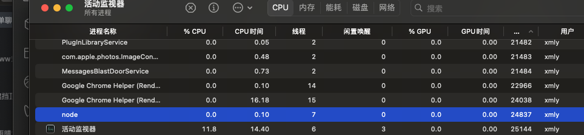

问题来源：

- Pm2 中的 cluster 模式和 fork 模式区别
- child_process 模块提供的 4 种新建子进程 API: spawn、execFile、exec 和 fork
- Nodejs 的 Cluster 模块采用了哪种集群模式？
- 多个进程为什么可以监听同一个端口？
- 多个进程之间如何通信？
- 如何对多个 Worker 进行请求分发？（负载均衡策略）
- Node 是怎么部署的? pm2 守护进程的原理?
- Node 开启子进程的方法有哪些?
- 什么是 IPC 通信，如何建立 IPC 通信？什么场景下需要用到 IPC 通信？

### 进程

> 进程和线程有点晕

进程是操作系统中正在运行的一个程序的实例，是系统进行资源分配和调度的基本单位，是操作系统结构的基础，进程是线程的容器（来自百科）。

在 Node.js 中，每个应用程序都运行在一个单独的进程中。 node app.js 就是开启一个服务进程，运行一个实例，多进程就是进程的复制（**child_process.fork**），child_process.fork 出来的每个进程都拥有自己的独立空间地址、数据栈，一个进程无法访问另外一个进程里定义的变量、数据结构，只有建立了 IPC 通信，进程之间才可数据共享，多进程的好处是可以充分利用多核 CPU 处理器的优势，通过将工作负载分配到多个进程中来提高应用程序的性能

### 线程

线程是操作系统能够进行运算调度的最小单位，首先我们要清楚线程是隶属于进程的，被包含于进程之中。一个线程只能隶属于一个进程，但是一个进程是可以拥有多个线程的。同一块代码，可以根据系统 CPU 核心数启动多个进程，每个进程都有属于自己的独立运行空间，进程之间是不相互影响的。同一进程中的多条线程将共享该进程中的全部系统资源，如**虚拟地址空间，文件描述符和信号处理**等。但同一进程中的多个线程有各自的调用栈（call stack），自己的寄存器环境（register context），自己的线程本地存储（thread-local storage)，线程又有单线程和多线程之分，具有代表性的 JavaScript、Java 语言。

### 单线程

单线程就是一个进程只开一个线程，想象一下一个痴情的少年，对一个妹子一心一意用情专一。 Javascript 就是属于单线程，程序顺序执行，可以想象一下队列，前面一个执行完之后，后面才可以执行，当你在使用单线程语言编码时切勿有过多耗时的同步操作，否则线程会造成阻塞，导致后续响应无法处理。你如果采用 Javascript 进行编码时候，请尽可能的使用**异步操作**。

```js
// compute.js
const http = require('http');
const [url, port] = ['127.0.0.1', 3000];

const computation = () => {
  let sum = 0;
  console.info('计算开始');
  console.time('计算耗时');

  for (let i = 0; i < 1e10; i++) {
    sum += i;
  }

  console.info('计算结束');
  console.timeEnd('计算耗时');
  return sum;
};

const server = http.createServer((req, res) => {
  if (req.url == '/compute') {
    const sum = computation();

    res.end(`Sum is ${sum}`);
  }

  res.end(`ok`);
});

server.listen(port, url, () => {
  console.log(`server started at http://${url}:${port}`);
});
```

单线程使用总结： Node.js 虽然是单线程模型，但是其基于事件驱动、异步非阻塞模式，可以应用于高并发场景，避免了线程创建、线程之间上下文切换所产生的资源开销。如果你有需要大量计算，CPU 耗时的操作，开发时候要注意。

### 多线程

多线程就是没有一个进程只开一个线程的限制，好比一个风流少年除了爱慕自己班的某个妹子，还在想着隔壁班的漂亮妹子。Java 就是多线程编程语言的一种，可以有效避免代码阻塞导致的后续请求无法处理。

多线程使用总结：

多线程的代价还在于创建新的线程和执行期上下文线程的切换开销，由于每创建一个线程就会占用一定的内存，当应用程序并发大了之后，内存将会很快耗尽。类似于上面单线程模型中例举的例子，需要一定的计算会造成当前线程阻塞的，还是推荐使用多线程来处理

### Nodejs 的线程与进程

Node.js 是 Javascript 在服务端的运行环境，构建在 chrome 的 V8 引擎之上，基于事件驱动、非阻塞 I/O 模型，充分利用操作系统提供的异步 I/O 进行多任务的执行，适合于 I/O 密集型的应用场景，因为异步，程序无需阻塞等待结果返回，而是基于回调通知的机制，原本同步模式等待的时间，则可以用来处理其它任务，在 Web 服务器方面，著名的 Nginx 也是采用此模式（事件驱动），Nginx 采用 C 语言进行编写，主要用来做高性能的 Web 服务器，不适合做业务。Web 业务开发中，如果你有高并发应用场景那么 Node.js 会是你不错的选择。在单核 CPU 系统之上我们采用 单进程 + 单线程 的模式来开发。在多核 CPU 系统之上，可以通过 **child_process.fork** 开启多个进程（Node.js 在 v0.8 版本之后新增了 **Cluster** 来实现多进程架构） ，即 多进程 + 单线程 模式。

> 注意：开启多进程不是为了解决高并发，主要是解决了单进程模式下 Node.js CPU 利用率不足的情况，充分利用多核 CPU 的性能。

关于 Node.js 进程的几点总结

- Javascript 是单线程，但是**做为宿主环境的 Node.js 并非是单线程**的。
- 由于单线程原故，一些复杂的、消耗 CPU 资源的任务建议不要交给 Node.js 来处理，当你的业务需要一些大量计算、视频编码解码等 CPU 密集型的任务，可以采用 C 语言。
- Node.js 和 Nginx 均采用**事件驱动**方式，避免了多线程的线程创建、线程上下文切换的开销。如果你的业务大多是**基于 I/O 操作**，那么你可以选择 Node.js 来开发。

> nodejs 适合处理基于 I/O 操作，不适合 CPU 密集型任务

### process 模块

Node.js 中的进程 Process 是一个全局对象，无需 require 直接使用，给我们提供了当前进程中的相关信息。

- process.env：环境变量，例如通过 process.env.NODE_ENV 获取不同环境项目配置信息
- process.nextTick：这个在谈及 Event Loop 时经常为会提到
- process.pid：获取当前进程 id
- process.ppid：当前进程对应的父进程
- process.cwd()：获取当前进程工作目录，
- process.platform：获取当前进程运行的操作系统平台
- process.uptime()：当前进程已运行时间，例如：pm2 守护进程的 uptime 值
- 进程事件：process.on(‘uncaughtException’, cb) 捕获异常信息、process.on(‘exit’, cb）进程推出监听
- 三个标准流：process.stdout 标准输出、process.stdin 标准输入、process.stderr 标准错误输出
- process.title 指定进程名称，有的时候需要给进程指定一个名称

#### 创建多进程 child_process、cluster 的应用

Node.js 提供了 child_process 模块，用于创建和管理子进程。通过**child_process**模块，我们可以在 Node.js 中创建新的进程，与其进行通信，并监视其状态。以下是一个简单的示例，演示了如何在 Node.js 中创建一个子进程并与主进程通信： 开启一个 http 服务，并通过 require('child_process').fork 创建一个子进程：

```js
// child_process.js
const http = require('http');
const fork = require('child_process').fork;
const path = require('path');
const server = http.createServer((req, res) => {
  if (req.url == '/compute') {
    const compute = fork(path.resolve(__dirname, './compute.js'));
    compute.send('开启一个新的子进程');

    // 当一个子进程使用 process.send() 发送消息时会触发 'message' 事件
    compute.on('message', (sum) => {
      res.end(`Sum is ${sum}`);
      compute.kill();
    });

    // 子进程监听到一些错误消息退出
    compute.on('close', (code, signal) => {
      console.log(`收到close事件，子进程收到信号 ${signal} 而终止，退出码 ${code}`);
      compute.kill();
    });
  } else {
    res.end(`ok`);
  }
});
server.listen(3000, () => {
  console.log(`server started at http://127.0.0.1:3000`);
});
```

#### 创建一个含有大量计算任务的处理逻辑

```js
// compute.js
const computation = () => {
  let sum = 0;
  console.info('计算开始');
  console.time('计算耗时');

  for (let i = 0; i < 1e10; i++) {
    sum += i;
  }

  console.info('计算结束');
  console.timeEnd('计算耗时');
  return sum;
};

process.on('message', (msg) => {
  console.log(msg, 'process.pid', process.pid); // 子进程id
  const sum = computation();

  // 如果Node.js进程是通过进程间通信产生的，那么，process.send()方法可以用来给父进程发送消息
  process.send(sum);
});
```

在上面的示例中，我们创建了一个 http 服务，并在接口http://127.0.0.1:3000/compute接口中使用require('child_process').fork()创建了一个子进程，将大量的计算逻辑放在了子进程中，这样一来，当我们频繁请求http://127.0.0.1:3000/compute接口时，我们的node服务就会并发处理这些计算逻辑密集型的逻辑，从而让接口有更快的响应。 试想如果此时没有开启子进程，而是将大量计算逻辑放到主进程，当有大量请求时会发生什么？ 答案：会变成每次请求都是同步的，前一个请求处理完毕，才会处理下一个，时间就会拉长，后面的请求响应就会变慢。

#### 使用 cluster 创建多进程

```js
const http = require('http');
const numCPUs = require('os').cpus().length;
const cluster = require('cluster');
if (cluster.isMaster) {
  console.log('Master proces id is', process.pid);
  // fork workers
  for (let i = 0; i < numCPUs; i++) {
    cluster.fork();
  }
  cluster.on('exit', function (worker, code, signal) {
    console.log('worker process died,id', worker.process.pid);
  });
} else {
  // 这里是一个http服务器
  http
    .createServer(function (req, res) {
      res.writeHead(200);
      res.end('hello word');
    })
    .listen(8000);
}
```

cluster 模块调用**cluster.fork()**来创建子进程，该方法与 child_process 中的 fork 是同一个方法。 cluster 模块采用的是经典的主从模型 Master-worker 模式，Cluster 会创建一个 master，然后根据你指定的数量复制出多个子进程，可以使用**cluster.isMaster**属性判断当前进程是 master 还是 worker(工作进程)。由 master 进程来管理所有的子进程，主进程不负责具体的任务处理，**主要工作是负责调度和管理**。 cluster 模块同时实现了负载均衡调度算法，在类 unix 系统中，cluster 使用轮转调度（round-robin），node 中维护一个可用 worker 节点的队列 free，和一个任务队列 handles。当一个新的任务到来时，节点队列队首节点出队，处理该任务，并返回确认处理标识，依次调度执行。而在 win 系统中，Node 通过 Shared Handle 来处理负载，通过将文件描述符、端口等信息传递给子进程，子进程通过信息创建相应的 SocketHandle / ServerHandle，然后进行相应的端口绑定和监听，处理请求。

### Pm2 中的 cluster 模式和 fork 模式区别

fork 模式，**单实例多进程**，常用于多语言混编，比如 php、python 等，不支持端口复用，需要自己做应用的端口分配和负载均衡的子进程业务代码。缺点就是单服务器实例容易由于异常会导致服务器实例崩溃。

cluster 模式，**多实例多进程**，但是只支持 node，端口可以复用，不需要额外的端口配置，0 代码实现负载均衡。优点就是由于多实例机制，可以保证服务器的容错性，就算出现异常也不会使多个服务器实例同时崩溃。

## 多个进程为什么可以监听同一个端口？

开启多进程时候端口疑问讲解：如果多个 Node 进程监听同一个端口时会出现 Error:listen EADDRIUNS 的错误，而 cluster 模块为什么可以让多个子进程监听同一个端口呢?

原因是**master 进程内部启动了一个 TCP 服务器，而真正监听端口的只有这个服务器**，当来自前端的请求触发服务器的 connection 事件后，master 会将对应的 socket 句柄发送给子进程。而 child_process 操作子进程时，创建多个 TCP 服务器， 无论是 child_process 模块还是 cluster 模块，为了解决 Node.js 实例单线程运行，无法利用多核 CPU 的问题而出现的。核心就是通过 fork()或者其他 API，创建了子进程之后，**父进程（即 master 进程）负责监听端口，接收到新的请求后将其分发给下面的 worker 进程**，父子进程之间才能通过 message 和 send()进行 IPC 通信（Inter-Process Communication）。

## 什么是 IPC 通信，如何建立 IPC 通信？什么场景下需要用到 IPC 通信？

IPC (Inter-process communication) ，即**进程间通信技术**，由于每个进程创建之后都有自己的独立地址空间，实现 IPC 的目的就是为了进程之间资源共享访问，实现 IPC 的方式有多种：管道、消息队列、信号量、Domain Socket，Node.js 通过 **pipe** 来实现。看一下 Demo，未使用 IPC 的情况

```js
// pipe.js
const spawn = require('child_process').spawn;
const child = spawn('node', ['worker.js']);
console.log(process.pid, child.pid); // 主进程id3243 子进程3244
// worker.js
console.log('I am worker, PID: ', process.pid);
```

控制台执行 node pipe.js，输出主进程 id、子进程 id，但是子进程 worker.js 的信息并没有在控制台打印，原因是新创建的子进程有自己的 **stdio** 流。

### 创建一个父进程和子进程之间传递消息的 IPC 通道实现输出信息

修改 pipe.js 让子进程的 stdio 和当前进程的 stdio 之间建立管道链接，还可以通过 spawn() 方法的 **stdout** 选项建立 IPC 机制，参考 options.stdio

```js
// pipe.js
const spawn = require('child_process').spawn;
const child = spawn('node', ['worker.js']);
child.stdout.pipe(process.stdout);
console.log(process.pid, child.pid);
```

再次验证，控制台执行 node pipe.js，worker.js 的信息也打印了出来

```js
$ 42473 42474
I am worker, PID:  42474
```

### 关于父进程与子进程是如何通信的？

参考了深入浅出 Node.js 一书，父进程在创建子进程之前会先去创建 IPC 通道并一直监听该通道，之后开始创建子进程并通过环境变量（NODE_CHANNEL_FD）的方式将 IPC 通道的**文件描述符**传递给子进程，子进程启动时根据传递的文件描述符去链接 IPC 通道，从而建立父子进程之间的通信机制。总结来说步骤：

- 1.父进程在创建子进程之前会先去创建 IPC 通道并一直监听该通道
- 2.开始创建子进程并通过环境变量（NODE_CHANNEL_FD）的方式将 IPC 通道的文件描述符传递给子进程
- 3.子进程启动时根据传递的文件描述符去链接 IPC 通道

## Node.js 是单线程还是多线程？进一步会提问为什么是单线程？

第一个问题，Node.js 是单线程还是多线程？这个问题是个基本的问题，在以往面试中偶尔提到还是有不知道的，Javascript 是单线程的，但是作为其在服务端运行环境的 **Node.js** 并非是单线程的。

```js
const http = require('http');

const server = http.createServer();
server.listen(3000, () => {
  process.title = '测试进程线程数量';
  console.log('进程id', process.pid);
});
```



创建了 http 服务，开启了一个进程，都说了 Node.js 是单线程，所以大家可能认为 Node 启动后线程数应该为 1，让我们使用 Mac 自带的活动监视器搜索进程 pid 来查看一下具体是几个线程：

可以看到线程数量是 7(macbook pro)，但是为什么会开启 7 个线程呢？难道 Javascript 不是单线程不知道小伙伴们有没有这个疑问？ 解释一下这个原因： Node 中最核心的是 v8 引擎，v8 是一个执行 JS 的引擎. 包括我们熟悉的编译优化, 垃圾回收等等.在 Node 启动后，会创建 v8 的实例，这个实例是多线程的。

- 主线程：编译、执行代码。
- 编译/优化线程：在主线程执行的时候，可以优化代码。
- 分析器线程：记录分析代码运行时间，为 Crankshaft 优化代码执行提供依据。
- 垃圾回收的几个线程。所以大家常说的 Node 是单线程的指的是 JavaScript 的执行是单线程的(开发者编写的代码运行在单线程环境中)，但 Javascript 的**宿主环境**，无论是 Node 还是浏览器都是多线程的

> js 执行是单线程，代码运行在单线程环境中

> js 的宿主环境是多线程

第二个问题，Javascript 为什么是单线程？这个问题需要从浏览器说起，在浏览器环境中对于 DOM 的操作，试想如果多个线程来对同一个 DOM 操作是不是就乱了呢，那也就意味着对于 DOM 的操作只能是单线程，避免 DOM 渲染冲突。在浏览器环境中 UI 渲染线程和 JS 执行引擎是互斥的，一方在执行时都会导致另一方被挂起，这是由 JS 引擎所决定的。

## 关于守护进程，是什么、为什么、怎么编写？

守护进程运行在后台不受终端的影响，什么意思呢？Node.js 开发的同学们可能熟悉，当我们打开终端执行 node app.js 开启一个服务进程之后，这个终端就会一直被占用，如果关掉终端，服务就会断掉，即前台运行模式。如果采用守护进程进程方式，这个终端我执行 node app.js 开启一个服务进程之后，我还可以在这个终端上做些别的事情，且不会相互影响。创建步骤：

- 创建子进程
- 在子进程中创建新会话（调用系统函数 **setsid**）
- 改变子进程工作目录（如：“/” 或 “/usr/ 等）
- 父进程终止

## 实现一个简单的**命令行交互程序**？

```js
const spawn = require('child_process').spawn;
const child = spawn('echo', ['简单的命令行交互']);
child.stdout.pipe(process.stdout); // 将子进程的输出做为当前进程的输入，打印在控制台
```

## 如何让一个 js 文件在 Linux 下成为一个可执行命令程序?

- 新建 hello.js 文件，头部须加上 **#!/usr/bin/env node**，表示当前脚本使用 Node.js 进行解析
- 赋予文件可执行权限 chmod +x chmod +x /${dir}/hello.js，目录自定义
- 在 **/usr/local/bin** 目录下创建一个软链文件 sudo ln -s /${dir}/hello.js /usr/local/bin/hello，文件名就是我们在终端使用的名字
- 终端执行 hello 相当于输入 **node hello.js**

## 消息队列

客户端同时产生大量网络请求，服务器承受能力有一定的限制

### 参考

- [Nodejs 进阶：解答 Cluster 模块的几个疑问](https://juejin.cn/post/6844904087771693070)
- [Node.js 进阶之进程与线程](https://juejin.cn/post/6844903869386850312?searchId=202312191842405B1FDFD95FBC6D001FEB)
- [深入了解 Node.js 中的多线程和多进程](https://zhuanlan.zhihu.com/p/573528198?utm_id=0)
- [谈谈 node 架构中的线程进程的应用场景、事件循环及任务队列](https://mp.weixin.qq.com/s/huyn95OyOz45J93B3WGXdA)
